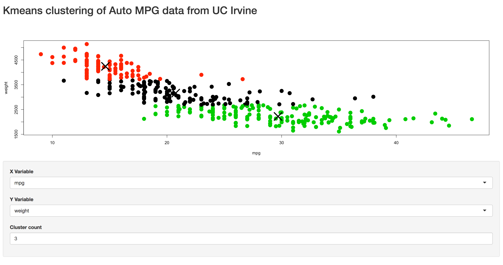

## Shiny App demonstration

> This app utilizes auto mpg data from UC Irvine, available at https://archive.ics.uci.edu/ml/datasets/Auto+MPG

> The original dataset has been clenaed for missing values, but in all other respects is unaltered

> Using Shiny, we can observer trends and relationships between the variables. In this app, we can calculate the kmeans for clusters in the data, varying from 1-9.

---

## Auto Dataset

> Below is an example of the dataset in use.

```{r head, echo=FALSE}
auto_mpg <- read.csv("AutoMPG.csv")
head(auto_mpg)
```

---

## K Means calculation

> k-means clustering aims to partition our observations into a defined number of clusters, in which each observation belongs to the cluster with the nearest mean.

> The center-point of the cluster then represents the mean of that partition.

---

## Example Plot

> A simple plot ilustrates the relationship between mpg and vehicle weight, however this does not lend itself to the type of analysis where we could group the data into categories.

```{r plot, echo=FALSE}
plot(x=auto_mpg$mpg, y=auto_mpg$weight, pch=20, cex=1)
```

---

## K means Plot

> On the other hand, a kmeans plot of the data can allow us to visualize where breaks in the samples occur.

> Additionally, our shiny app can allow comparison of any two variables in the data set, and visualization of a number of different k-means buckets or partitions.

```{r, echo=FALSE, out.width="700px"}

```


