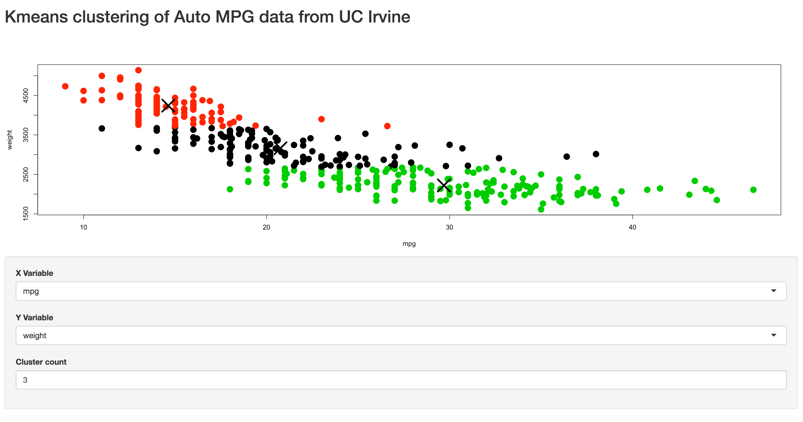

## Shiny App demonstration

> This app utilizes auto mpg data from UC Irvine, available at https://archive.ics.uci.edu/ml/datasets/Auto+MPG

> The original dataset has been clenaed for missing values, but in all other respects is unaltered

> Using Shiny, we can observer trends and relationships between the variables. In this app, we can calculate the kmeans for clusters in the data, varying from 1-9.

---

## Auto Dataset

> Below is an example of the dataset in use.


```
##   X mpg cylinders displacement horsepower weight acceleration model.year
## 1 1  18         8          307      130.0   3504         12.0         70
## 2 2  15         8          350      165.0   3693         11.5         70
## 3 3  18         8          318      150.0   3436         11.0         70
## 4 4  16         8          304      150.0   3433         12.0         70
## 5 5  17         8          302      140.0   3449         10.5         70
## 6 6  15         8          429      198.0   4341         10.0         70
##   origin                  car.name
## 1      1 chevrolet chevelle malibu
## 2      1         buick skylark 320
## 3      1        plymouth satellite
## 4      1             amc rebel sst
## 5      1               ford torino
## 6      1          ford galaxie 500
```

---

## K Means calculation

> k-means clustering aims to partition our observations into a defined number of clusters, in which each observation belongs to the cluster with the nearest mean.

> The center-point of the cluster then represents the mean of that partition.

---

## Example Plot

> A simple plot ilustrates the relationship between mpg and vehicle weight, however this does not lend itself to the type of analysis where we could group the data into categories.


---

## K means Plot

> On the other hand, a kmeans plot of the data can allow us to visualize where breaks in the samples occur.

> Additionally, our shiny app can allow comparison of any two variables in the data set, and visualization of a number of different k-means buckets or partitions.




